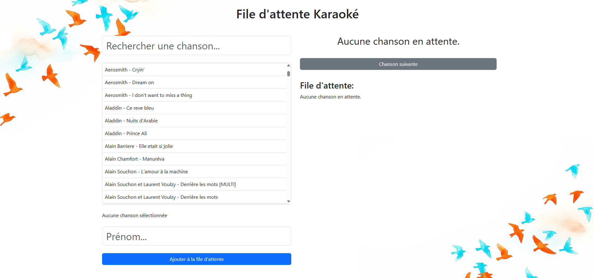

# Karaoke Queue App

A simple web application to manage karaoke song requests and queue.

## Features

- Add songs to the queue
- Remove songs from the queue
- View current and upcoming songs
- User-friendly interface

## Getting Started

### Prerequisites

- A web browser

### Installation

- Clone the repository.

### Running the App

- Open index.html in your web browser.

## Usage

1. Open the app in your browser.
2. Load a txt file with all the songs (1 by line).
3. Add your song requests.
4. Enjoy your karaoke session!
